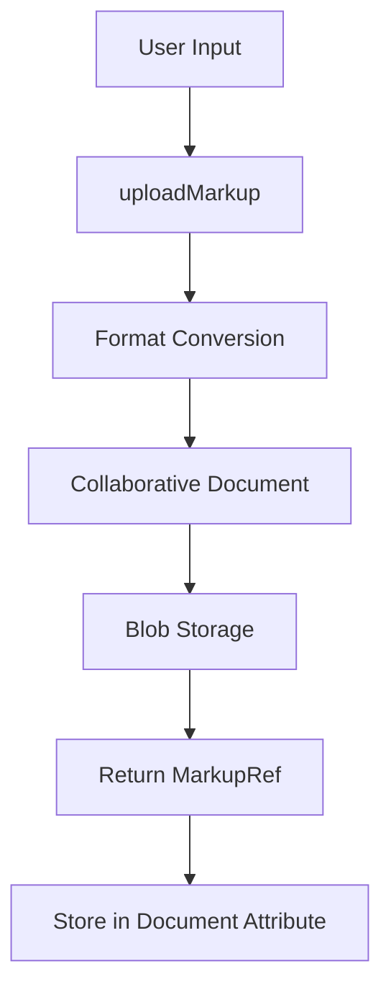

# Huly Markup Storage and Return Values

## Overview

This document explains how the `uploadMarkup` method returns work, how descriptions and other markup content are stored in Huly, and the relationship between `MarkupRef`, blob storage, and collaborative documents.

## MarkupRef Return Value

### What is MarkupRef?

```typescript
type MarkupRef = Ref<Blob>
type MarkupBlobRef = MarkupRef | null
```

A `MarkupRef` is essentially a reference (ID) to a blob stored in Huly's collaborative document system. It's not the content itself, but a pointer to where the content is stored.

### Return Value Structure

```typescript
// Example return value
const markupRef: MarkupRef = "blob:markup:abc123def456" as Ref<Blob>
```

The `MarkupRef` is:
- A unique identifier for the stored markup blob
- Used to retrieve the content later via `fetchMarkup`
- Stored in document attributes that expect markup content
- Immutable - each upload creates a new reference

## Storage Architecture

### 1. Collaborative Document System

Huly uses a collaborative document system for storing markup content:

```typescript
// Internal process when uploadMarkup is called
const collabId = makeCollabId(objectClass, objectId, objectAttr)
const markupRef = await this.collaborator.createMarkup(collabId, markup)
```

### 2. Blob Storage Layer

The markup content is stored as blobs with these characteristics:
- **Immutable**: Each change creates a new blob
- **Versioned**: Previous versions remain accessible
- **Collaborative**: Supports real-time editing
- **Efficient**: Large content is stored separately from document metadata

### 3. Document Attribute Storage

Document attributes store the `MarkupRef`, not the content:

```typescript
// Document structure example
interface Issue {
  _id: Ref<Issue>
  title: string
  description: MarkupBlobRef  // Stores the reference, not content
  // ... other fields
}
```

## How Descriptions Are Stored

### 1. Issue Descriptions

```typescript
// Issue model definition
@Model(tracker.class.Issue, task.class.Task)
export class TIssue extends TTask implements Issue {
  @Prop(TypeCollaborativeDoc(), tracker.string.Description)
  @Index(IndexKind.FullText)
    description!: MarkupBlobRef | null
}
```

**Storage Process**:
1. User enters description in HTML/Markdown
2. `uploadMarkup` converts to internal format
3. Content stored as collaborative blob
4. `MarkupRef` saved in `issue.description` field

### 2. Document Content

```typescript
// Document model definition
@Model(documents.class.Document, core.class.AttachedDoc)
export class TDocument extends TAttachedDoc implements Document {
  @Prop(TypeCollaborativeDoc(), documents.string.Content)
    content!: MarkupBlobRef
}
```

### 3. Comment Messages

```typescript
// ChatMessage model definition
@Model(chunter.class.ChatMessage, activity.class.ActivityMessage)
export class TChatMessage extends TActivityMessage implements ChatMessage {
  @Prop(TypeMarkup(), chunter.string.Message)
  @Index(IndexKind.FullText)
    message!: string  // Note: This is direct markup, not a ref
}
```

## Content Retrieval Process

### 1. Fetching Stored Content

```typescript
// Retrieve content using the stored reference
const content = await client.fetchMarkup(
  tracker.class.Issue,
  issueId,
  'description',
  issue.description, // The MarkupRef
  'html'
)
```

### 2. Automatic Resolution in Queries

When querying documents, Huly can automatically resolve markup references:

```typescript
// The issue object contains the reference
const issue = await client.findOne(tracker.class.Issue, { _id: issueId })
console.log(issue.description) // "blob:markup:abc123def456"

// To get the actual content
const descriptionHtml = await client.fetchMarkup(
  tracker.class.Issue,
  issueId,
  'description',
  issue.description,
  'html'
)
```

## Storage Lifecycle

### 1. Creation Flow



### 2. Update Flow

```typescript
// Updating description creates a new blob
const newMarkupRef = await client.uploadMarkup(
  tracker.class.Issue,
  issueId,
  'description',
  '<p>Updated description</p>',
  'html'
)

// Update the document with new reference
await client.update(issue, {
  description: newMarkupRef
})
```

### 3. Version History

- Old `MarkupRef` values remain in blob storage
- Document history tracks reference changes
- Collaborative editing maintains version history

## Practical Examples

### 1. Creating an Issue with Description

```typescript
// Step 1: Upload the description markup
const descriptionRef = await client.uploadMarkup(
  tracker.class.Issue,
  generateId(), // Future issue ID
  'description',
  '# Bug Report\n\nThis is a **critical** bug.',
  'markdown'
)

// Step 2: Create the issue with the reference
const issue = await client.createDoc(
  tracker.class.Issue,
  projectId,
  {
    title: 'Critical Bug',
    description: descriptionRef,
    // ... other fields
  }
)
```

### 2. Reading Issue Description

```typescript
// Get the issue
const issue = await client.findOne(tracker.class.Issue, { _id: issueId })

// Check if description exists
if (issue.description) {
  // Fetch the actual content
  const descriptionHtml = await client.fetchMarkup(
    tracker.class.Issue,
    issueId,
    'description',
    issue.description,
    'html'
  )
  
  const descriptionMarkdown = await client.fetchMarkup(
    tracker.class.Issue,
    issueId,
    'description',
    issue.description,
    'markdown'
  )
}
```

### 3. Updating Description

```typescript
// Upload new content
const newDescriptionRef = await client.uploadMarkup(
  tracker.class.Issue,
  issueId,
  'description',
  '<p>Updated description with <strong>new</strong> content</p>',
  'html'
)

// Update the issue
await client.update(issue, {
  description: newDescriptionRef
})
```

## Key Differences: Direct vs Reference Storage

### Reference Storage (MarkupBlobRef)
- **Used for**: Issue descriptions, document content, large markup
- **Storage**: `MarkupRef` in document, content in blob storage
- **Benefits**: Collaborative editing, version history, efficient storage
- **Examples**: `issue.description`, `document.content`

### Direct Storage (string)
- **Used for**: Chat messages, short text fields
- **Storage**: Markup string directly in document
- **Benefits**: Simple queries, immediate access
- **Examples**: `chatMessage.message`, `comment.text`

## Performance Considerations

### 1. Lazy Loading
- Document queries don't load markup content automatically
- Content fetched on-demand via `fetchMarkup`
- Reduces query payload size

### 2. Caching
- Blob storage implements caching for frequently accessed content
- Client-side caching of resolved markup

### 3. Collaborative Editing
- Real-time updates through collaborative document system
- Operational transforms for conflict resolution

## Best Practices

### 1. Always Check for Null
```typescript
if (issue.description) {
  const content = await client.fetchMarkup(/* ... */)
}
```

### 2. Choose Appropriate Storage Type
- Use `MarkupBlobRef` for large, editable content
- Use direct string storage for simple, short text

### 3. Handle Async Operations
```typescript
try {
  const markupRef = await client.uploadMarkup(/* ... */)
  await client.update(doc, { description: markupRef })
} catch (error) {
  console.error('Failed to update description:', error)
}
```

### 4. Batch Operations
```typescript
// Upload multiple markup fields efficiently
const [descriptionRef, notesRef] = await Promise.all([
  client.uploadMarkup(/* description */),
  client.uploadMarkup(/* notes */)
])
```

## Related Types and Interfaces

```typescript
// Core types
type MarkupRef = Ref<Blob>
type MarkupBlobRef = MarkupRef | null
type MarkupFormat = 'markup' | 'html' | 'markdown'

// Collaborative document type
@Prop(TypeCollaborativeDoc(), label)
  field!: MarkupBlobRef

// Direct markup type  
@Prop(TypeMarkup(), label)
  field!: string
```
